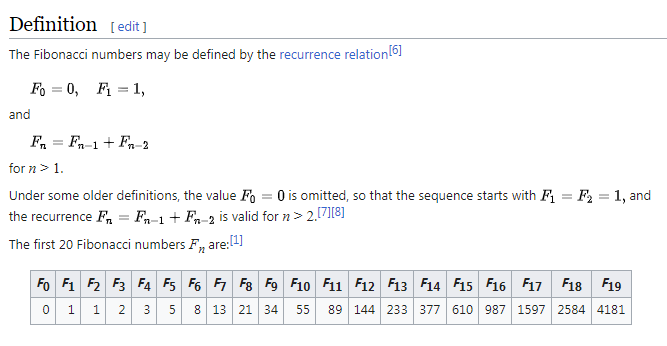
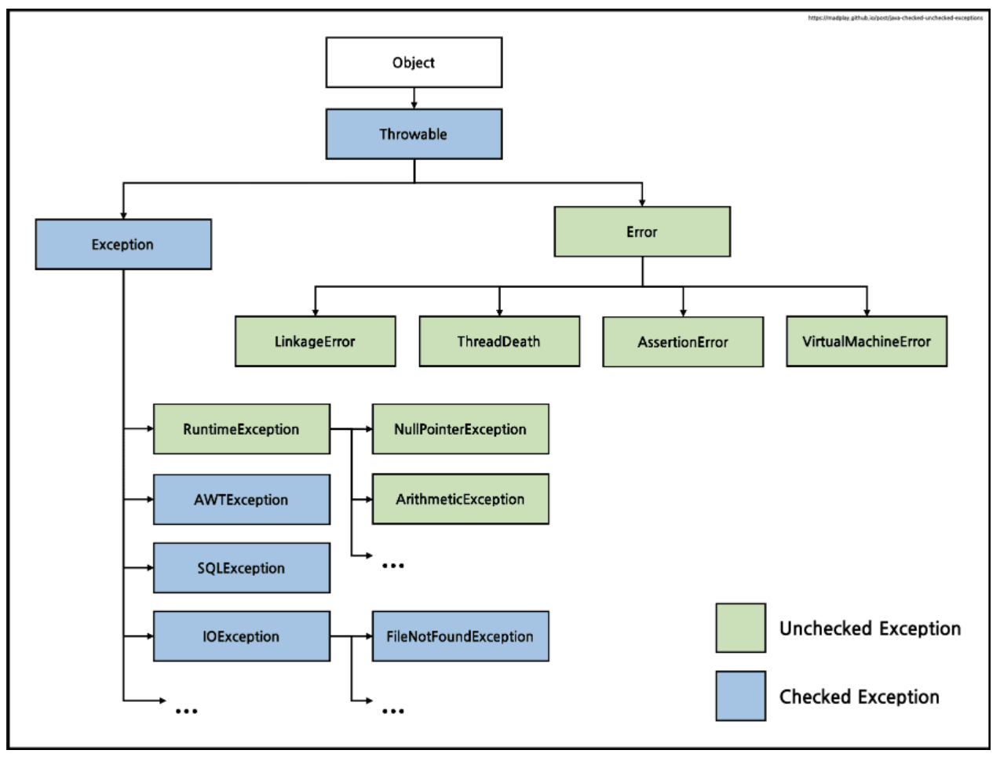
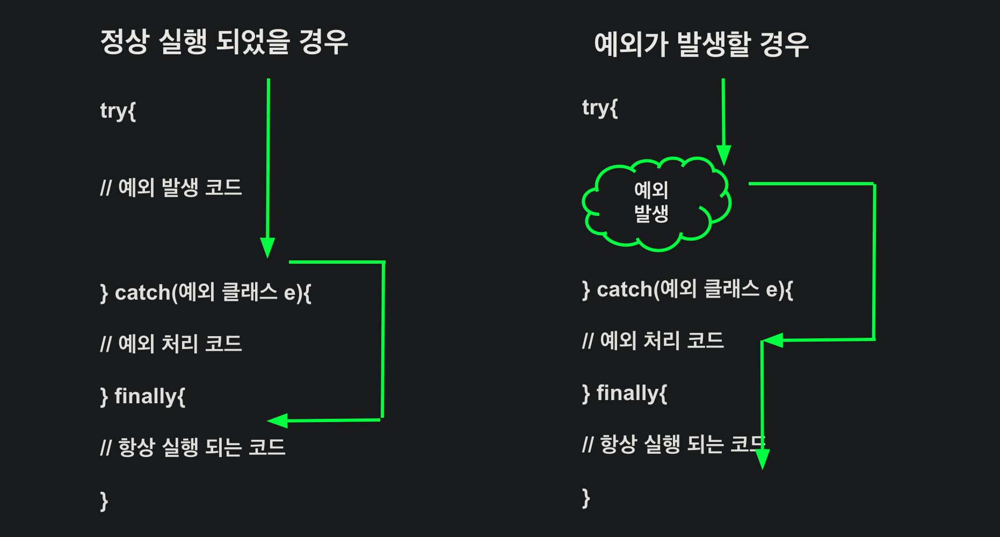

> 💡 **Finobacci 코드를 통해 Recursion 구현 및 테스트**


## Class Method (Procedure)

- Example: `java.lang.Math`
- 자바에서의 class = 집합
- MathxTest()와 같은 default constructor가 사용되지 않도록 private으로 막아야 한다.

## Test Code

- Unit Test (단위 테스트)
- Test Suit → JUnit
- **Recursion**

## Fibonacci Code

  

```java 
// Mathx.java
// 피보나치 (0, 1, 1, 2, 3, 5, ... )

public static int fibonacci(int n) {
        if (n < 0) {
            throw new IllegalArgumentException("fibonacci: n < 0");
        }

        else if (n == 0) {
            return 0;
        }
        
        else if (n == 1) {
            return 1;
        }
        return Math.addExact(fibonacci(n - 1), fibonacci(n - 2));
    }
```

```java
public static void fibonacciTest() {
        FibonacciTest.baseCase();
        FibonacciTest.recursionCase();
        FibonacciTest.preCondition();   // require
        FibonacciTest.postCondition();  // satisfy
}

public static void main(String[] args) {
        
        MathxTest.factorialTest();
}
```

## FibonacciTest.java

### 1. BaseCase와 RecursionCase

```java

// BaseCase와 RecursionCase를 나누어서 테스트

import static NHN20230802.practice.Mathx.*;

public class FibonacciTest {

    public static void preCondition() {
        try {
            fibonacci(-1);
        } catch (IllegalArgumentException e) {
            return;
        }
        System.exit(1);
    }

    public static void postCondition() {
        try {
            for (int i = 0; i < 100; i++) {
                fibonacci(i);
                // System.out.print(i + " ");
            }
        }

        catch (ArithmeticException e) {
            return;
        }
        System.exit(1);
    }

    public static void baseCase() {
        if (fibonacci(0) == 0 && fibonacci(1) == 1) {
            System.out.println("Base Case");
            return;
        } else {
            System.exit(1);
        }
    }

    public static void recursionCase() {

        int[][] answers = {{5, 5}, {6, 8}, {7, 13}, {8, 21}, {9, 34}, {11, 89}, {13, 233}};

        for (int[] answer : answers) {
            if (answer[1] != fibonacci(answer[0])) {
                System.exit(1);
            }
        }
        System.out.println("Recursion Case");
    }

}
```

- `base case`와 `recursion case` 두가지 케이스로 구성
- **Test Case**는 base case와 recursion case를 만족하도록 작성
- preCondition → 넘어오는 n의 값이 양수인지 확인 후 테스트를 하도록 한다.

- Continue, break → Non-local jump


> 💡 에러는 **Throw** 해서 오류 처리해보자

### 🛠️ Exception hierarchy




### 2. preCondition

- 피보나치는 n의 값이 1보다 커야하는 조건이 존재
- **fibonacci(-1)** 일 때는 오류가 발생 → `throw new ArgumentException();` 사용

```java
public static void preCondition() {
        try {
            fibonacci(-1);
        } catch (ArgumentException e) {
            return;
        }
        System.exit(-1);
    }
```

### 3. postCondition

1. `Math.addExact()`  : int의 MAX_VALUE를 넘어갈 경우 Exception을 발생시킨다.
2. `throw new ArithmeticException()` : 을 사용하여 Exception 발생

```java
public static void postCondition() {
        try {
            for (int i = 0; i < 100; i++) {
                fibonacci(i);
                // System.out.print(i + " ");
            }
        }

        catch (ArithmeticException e) {
            return;
        }
        System.exit(1);
    }
```

## Factorial Code & Test

```java
public static void factorialTest() {
        FactorialTest.baseCase();
        FactorialTest.recursionCase();
        FactorialTest.preCondition();
        FactorialTest.postCondition();
    }

public static void main(String[] args) {
        MathxTest.factorialTest();
    }
```

```java
// factorial : n! = n * (n-1)!
    public static int factorial(int n) {

        // base case
        if (n == 0) {
            return 1;
        }

        // preCondition
        else if (n < 0) {
            throw new IllegalArgumentException("factorial n < 0");
        }

        // recursion case & postCondition
        return Math.multiplyExact(n, factorial(n - 1));
    }
```

### FactorialTest.java

```java
package NHN20230802.practice;

import static NHN20230802.practice.Mathx.*;

public class FactorialTest {

    public static void baseCase() {
        if (factorial(0) == 1) {
            System.out.println("Success Base Case");
            return;
        } else {
            System.exit(1);
        }
    }

    public static void recursionCase() {
        int[][] answers = {{1, 1}, {2, 2}, {3, 6}, {4, 24}, {5, 120}, {6, 720}, {7, 5040}, {8, 40320}};
        
        for (int[] answer : answers) {
            if (answer[1] == factorial(answer[0])) {
                System.out.println("Success Recursion Case");
                return;
            }
            else {
                System.exit(1);
            }
        }
    }

    
    public static void preCondition() {
        try {
            factorial(-1);
        } catch(IllegalArgumentException e) {
            System.out.println("facotiral : IllegalArgumentException");
            return;
        }
        System.exit(1);
    }

    public static void postCondition() {
        try {
            factorial(Integer.MAX_VALUE);
        } catch(ArithmeticException e) {
            System.out.println("factorial : ArithmeticException");
            return;
        } catch(StackOverflowError e) {
            System.out.println("factorial : StackOverflowError");
            return;
        }
        System.exit(1);
    }

}
```

- 해당 코드에서 System.exit(1)이 아닌 `assert` 를 사용해서 변경해보자.

    ```java
    package NHN20230802.practice;
    
    import static NHN20230802.practice.Mathx.*;
    
    public class FactorialTest {
    
        public static void baseCase() {
        
            assert factorial(0) == 1;
        }
    
        public static void recursionCase() {
            int[][] answers = {{1, 1}, {2, 2}, {3, 6}, {4, 24}, {5, 120}, {6, 720}, {7, 5040}, {8, 40320}};
            
            for (int[] answer : answers) {
                assert factorial(answer[0]) == answer[1];
            }
        }
    
        
        public static void preCondition() {
            try {
                factorial(-1);
            } catch(IllegalArgumentException e) {
                System.out.println("facotiral : IllegalArgumentException");
                return;
            }
            assert false;
        }
    
        public static void postCondition() {
            try {
                factorial(Integer.MAX_VALUE);
            } catch(ArithmeticException e) {
                System.out.println("factorial : ArithmeticException");
                return;
            } catch(StackOverflowError e) {
                System.out.println("factorial : StackOverflowError");
                return;
            }
            assert false;
        }
    
    }
    ```


```java

    public static void postCondition() {
        try {
            factorial(Integer.MAX_VALUE);
        } catch(ArithmeticException e) {
            System.out.println("factorial : ArithmeticException");
            return;
        } catch(StackOverflowError e) {
            System.out.println("factorial : StackOverflowError");
            return;
        }
        assert false;
    }

```

- 해당 코드에서 factorial(Integer.MAX_VALUE)를 넣게 되면 StackOverflowError가 발생하게 된다.
    - **Activation Record** → Call Stack

**factorial(3)을 예시로 들어보자**

```java
factorial(3)
3 * factorial(2)
3 * 2 * factorial(1)
3 * 2 * 1 * factorial(0)
3 * 2 * (1 * 1)
3 * (2 * 1)
(3 * 2)
6
```

- **Recursion**은 좋은 문제 풀이 방법일 뿐 Recursive Process가 아니다
- `**preCondition, postCondition**` 을 검사하자
- `throw - exception` 은 **Call Stack**을 따라 올라가 호출한 사람에게 오류가 발생한 것을 알림

## 빅오 표기법(Big-O notation) / Order of Growth

- **Big-O : 최악 실행 시간**
- **Big-Ω : 최상 실행 시간**
- **Big-θ : 평균 실행 시간**